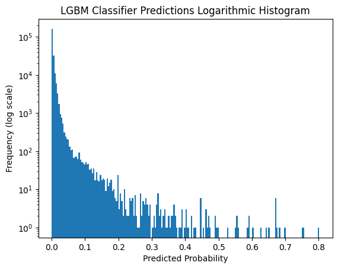
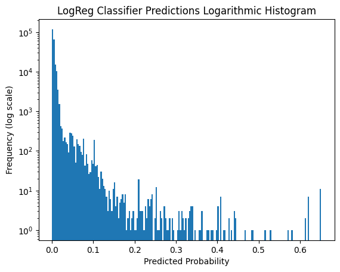

# Background
Binary Classification ML problem to predict which credit card transactions are fraudulent. 

# Method
LGBM model with Bayesian optimization via Optuna. LogReg was also tried but performed worse.

# Score
LGBM3 scored 0.82786, Ranked 27 out of 643.

Competition found here: https://www.kaggle.com/competitions/playground-series-s3e4
